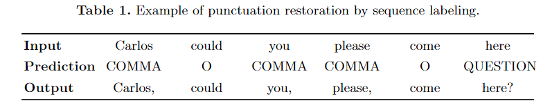

# Relatório de Errors de anotação

## Character-span não padronizado

Erro encontrado durante o pré-processamento

O algoritmo BERT foi treinado para tratar o problema de pontuação como sequence labelling a partir de uma palavra ou seja, deve haver uma palavra a qual seja necessária a pontuação depois dela. Ex.:

No entando as anotações fazem match com character-span que nem sempre correspondem a palavra anterior que deve ser pontuada ora fazendo match com o caracter espaço em branco (onde deveria ser pontuado) (ou onde a pontuação errada) ora fazendo match com a palavra anterior ou uma parte da palavra anterior ou mais de uma palavra. Ex.:

### 1. Match espaço em branco

Olá **\s**mundo ou Olá, Mundo

### 2. Match palavra anterior

**Olá**\smundo

### 3. Match parcial

O**lá**\smundo

### 4. Caracter-span maior que uma única palavra

**Olá\smundo**

### Solução

Para não perdermos muitas das anotações precisamos captura sempre um padrão de anotação para isso considero a última posição do char-span da anotação e volto no até encontrar o próximo espaço em branco fazendo match com a palavra inteira ao invés de apenas um char-span.

1. Olá **\s**mundo
2. Ol**á**\smundo
3. O**lá**\smundo
4. **Olá**\smundo

## 2. Caracteres especiais (tags)

Encontrado durante pré-processamento

Foram removidos usando regex e o título separado do restante do texto já que não precisa de pontuação (apesar de alguns alunos pontuarem).

[T] = TÍTULO – para indicar título

[P] = PARÁGRAFO – para indicar espaço de parágrafo

[X] = RASURA – inclui o caso de utilização de corretivo

[?] = ILEGÍVEL

[?] + ENTER = LINHA ILEGÍVEL – para indicar a linha toda como ilegível e não apenas uma palavra.

[S] = SÍMBOLO

[LT] = LINHA TORTA/TRONCHA

[LC] = LINHA CRUZADA = para quando uma linha invadia a outra.

[MI] = MARCAÇÃO INCORRETA – para quando tem duas ou mais palavras corretas, sem cortes, reunidas em um só retângulo de marcação. Deve-se utilizar esse marcador para ajudar a IA a realizar a marcação por palavra.

[TOI] = TEXTO ORIENTADO INCORRETAMENTE – para quando o texto for legível e aparecer com a orientação fora do padrão, na horizontal. A ideia é que esse texto entre em um banco de dados e possa ser reaproveitado depois, após correção na orientação.

## 3. Texto Não pontuado e não anotado

Encontrado durante a avaliação usando cohen's kappa score para verificar a concordância entre os anotadores.

(Anotações com problema) 

**Skipped:** 30

**Total anotações:** 262

**Média kappa:** 0.6051827413000723

**Std kappa:** 0.3000029332320617

**Max kappa:** 1.0

**Min kappa:** -0.024048096192384794

**Mediana kappa:** 0.6586593043216589

Existem casos onde nem o aluno pontuou o texto e nem os anotadores indicaram o lugar o onde a pontuação deveria estar e qual pontuação seria como na anotação abaixo. Isso causa um erro na avaliação cohen's kappa porque só temos uma label em ambas anotações fazendo com que seja retornado o valor Nan (not a number).

{"id":311,"text":"[T] Eu e meus amigos\n[P] Era uma vez eu e meus amigo fisemos um um\njardem ates uma imudação aconteceu e u jardim não\nficou o mesmo e em tão fisemos jardem e ele fcou\ncheio de floris e eu ficamos sen regar ele e ele ficou \nmueto seco e morel e um respnemo [X] outro\njardim com nos estacou jardim e em a fazer ou\ntro jardm o fico tambem lendo e foi Pasando o tem-\nPo e mos foi fican adutos atér mos e npos amiges\nnão agon so no ficamos Doente e fomos curade\nPor ireros que um ecezom res no [?] muito\njodem e chanas asor os amigo que nos mão \nedes timos do jaros menor no me se idso jarden\nels fizemmsm oulo jardem mas que nos fiseno\ne fico muito bonitos e morte elegam Com\nmeu no jarden elegam [?] foi Pelo es bíexb e \nele foran or tro ma len coloreído",

"label":[[25,74,"Orientação"],[38,40,"Narrador"],[38,53,"Personagem"],[43,53,"Erro concordância nominal\/verbal"],[54,62,"grafia de palavras"],[54,74,"Ação"],[68,75,"Lugar\/Espaço"],[68,75,"grafia de palavras"],[75,80,"grafia de palavras"],[80,241,"Complicação"],[84,93,"grafia de palavras"],[105,107,"grafia de palavras"],[134,140,"Desvios de hipersegmentação\/ hipossegmentação"],[141,149,"grafia de palavras"],[149,156,"grafia de palavras"],[176,183,"grafia de palavras"],[223,229,"grafia de palavras"],[236,242,"grafia de palavras"],[316,322,"grafia de palavras"],[329,336,"grafia de palavras"],[382,389,"grafia de palavras"],[389,394,"grafia de palavras"],[405,411,"grafia de palavras"],[450,456,"grafia de palavras"],[588,751,"Desfecho"],[679,686,"grafia de palavras"],[722,728,"grafia de palavras"],[742,751,"grafia de palavras"]]}

Solução

Desconsiderar os textos (?)

## 4. Quebra de linha mal formada

Encontrado durante predição usando o BERT e consertada no pré-processamento

Quebra de linha mal formada /n_ ao invés de \n.

### Solução:

Substituição via regex

## 5. Quebra palavra mal formada

Na escrita as vezes a necessidade de terminar uma palavra e continuar a mesma palavra em outra linha. Isso deverá ser indicado usando - ou \_. porém alguns alunos não fazem isso e se tornar inviável saber se é uma única palava ou duas palavras diferentes.

Ex.:

arrumado

arru\nmado (?)

### Solução parcial:

para os outros casos a solução foi unir palavras separadas por -\n ou \_\n usando regex.

arru-\nmado -\> arrumado

arru_\nmado -\> arrumado

_______________________________________
## Outros problemas (Predição)

##

## 1. Tamanho do texto muito grande

Em muitos casos os textos são demaseadamente grandes o que não é comportato pelo max\_len do bert que é de 512 (o bert tokeniza muitas vezes uma palavra em mais de um token).

Solução:

Existem alunos que não escrevem parágrafos então solução foi quebrar o texto em quebras de linha.

